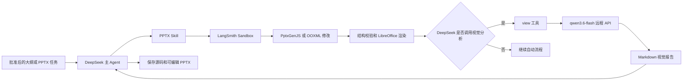

# PPTX Skill 视觉适配设计

## 状态

- 日期：2026-08-19
- 状态：已在对话中批准，等待书面规范审阅
- 范围：原样加载 PPTX Skill，并通过 `view` 工具接入远程 `qwen3.6-flash`

## 背景

项目使用 Deep Agents 编排 PPT 需求收集、大纲审批、生成、渲染、检查和保存。主 Agent 使用 `deepseek-v4-flash`，现已在 `agent/model.py` 中增加远程 `qwen3.6-flash` 模型，用于视觉分析。

仓库中的 `agent/skills/pptx` 已覆盖从零创建、读取、模板套用、编辑已有 PPTX/POTX、OOXML 操作、结构校验和 LibreOffice 渲染。该 Skill 的视觉 QA 要求把逐页渲染图交给名为 `view` 的工具，但当前项目尚未提供该工具，也尚未把 Skill 安装到 LangSmith Sandbox 或传给 `create_deep_agent`。

经讨论，本阶段不改写或裁剪 PPTX Skill。先保持原版行为，使用外围适配满足其运行假设，并通过实际任务评估后再决定是否需要证据驱动的最小修改。

## 已确认决策

1. `agent/skills/pptx` 原样保留，本阶段不得产生文件 diff。
2. 视觉模型使用远程 `qwen3.6-flash`，暂不设计自部署、量化或本地推理。
3. Qwen 参与参考图分析、设计反馈和渲染 QA，但只提供分析和建议，不写文件、不执行命令。
4. DeepSeek 是唯一执行者，负责调用 Skill、编写 PptxGenJS 或 OOXML 修改、运行命令和修复产物。
5. Qwen 的调用时机和修订轮数由 DeepSeek 自行决定，不增加固定视觉关卡或轮数上限。
6. 使用一个名为 `view` 的工具连接 Qwen，以兼容原 Skill 的现有指引。
7. `view` 返回自由 Markdown 文本，不增加结构化报告 schema。
8. 视觉素材仅来自用户输入、PptxGenJS 原生图形和图表，以及镜像内置的开源图标；本阶段不联网检索图片，也不接入图片生成模型。
9. PPTX Skill 当前许可证的内部保留和修改用途已有明确授权。

## 目标

1. 在不修改 PPTX Skill 的前提下，使其能够在 LangSmith Sandbox 中被 Deep Agents 发现和加载。
2. 提供与原 Skill 指引兼容的 `view` 工具，将 Sandbox 图片发送给远程 `qwen3.6-flash`。
3. 保持 DeepSeek 与 Qwen 的清晰权限边界，确保 Qwen 不能修改 Sandbox 文件。
4. 为后续 Sandbox 镜像和 `/workspace` 挂载设计稳定的路径契约。
5. 对图片读取、模型调用和失败行为建立可测试的最小契约。

## 非目标

- 不修改 `agent/skills/pptx/SKILL.md`、脚本、schema 或许可证文件。
- 不重构原 Skill 为多个 reference 文件。
- 不设计视觉模型自部署、量化、推理框架或 GPU 容量。
- 不实现 Sandbox 镜像构建。
- 不实现宿主机目录到 Sandbox `/workspace` 的挂载。
- 不增加联网图片搜索、图片生成、对象存储或自定义演示文稿编辑器。
- 不在本设计中完成批准后生成阶段的完整图编排。

## 总体架构



### DeepSeek 主 Agent

DeepSeek 负责所有会改变状态的操作，包括：

- 选择创建、读取、模板或编辑工作流；
- 编写和修改 PptxGenJS 源码；
- 解包、修改和重新打包 OOXML；
- 执行 Skill 脚本和系统命令；
- 解释 Qwen 的视觉报告；
- 决定是否修订、再次渲染或停止；
- 保存最终可编辑 PPTX 和相关源文件。

### Qwen 视觉模型

Qwen 只接收图片和文字提示，返回视觉分析。它不接收 Sandbox backend，不获得文件系统工具，也不运行生成脚本。其结果是建议性输入，不能覆盖用户明确要求、已批准大纲或确定性校验结果。

### PPTX Skill

PPTX Skill 保持原样。Sandbox 镜像后续需要将其完整安装到 `/skills/pptx/`，主 Agent 后续通过 `skills=["/skills/"]` 加载。Skill 的全部脚本和 schema 必须保留，不能只复制 `SKILL.md`。

## 路径契约

后续镜像和挂载按以下 Sandbox 可见路径协作：

| 路径 | 用途 |
| --- | --- |
| `/skills/pptx/` | 原样安装的 PPTX Skill |
| `/workspace/input/` | 用户输入的 PPTX、POTX、图片和其他素材 |
| `/workspace/.work/<job-id>/` | 解包目录、生成脚本、渲染图片和其他中间文件 |
| `/workspace/output/` | 最终 PPTX、生成源码和正式渲染产物 |

生成阶段提示词负责把 Skill 文档中的 `scripts/...` 相对路径解析为 `/skills/pptx/scripts/...`。所有编辑应先复制输入文件，在工作副本上执行，并显式指定输出路径，避免脚本默认原地覆盖用户文件。

宿主机 `/Volumes/ExternalStorageA/project/2026.8/ppt-deepagent/workspace/<thread_id>/` 如何挂载为 Sandbox `/workspace`，由后续挂载设计确定，不属于本阶段实现。

## `view` 工具契约

### 输入

```python
view(
    image_paths: list[str],
    prompt: str,
) -> str
```

- `image_paths` 至少包含一个 Sandbox 内的绝对路径。
- 支持 PNG、JPG、JPEG 和 WEBP。
- `prompt` 说明视觉任务和必要上下文，例如模板分析、设计反馈、逐页缺陷检查或整稿一致性审查。
- DeepSeek 负责选择图片、编写提示和决定是否拆分多次调用。

### 执行

1. 工具绑定当前 Thread 的 LangSmith Sandbox backend。
2. 工具使用 `backend.download_files(image_paths)` 读取原始图片字节。
3. 工具根据扩展名确定 MIME 类型，并把图片与 `prompt` 组合成多模态消息。
4. 工具调用 `agent/model.py` 暴露的 `qwen_model`。
5. 工具把 Qwen 返回的 Markdown 文本原样交给 DeepSeek。

### 输出

返回值是自由 Markdown 文本，不要求 `pass/revise`、严重级别、问题类别或逐页结构化字段。提示词应要求 Qwen 尽量引用文件名或页码，并给出具体、可执行的观察和建议，但工具不解析或重写模型回答。

## 错误处理

1. `image_paths` 为空、包含相对路径或不支持的扩展名时，在调用 Qwen 前失败。
2. 任一图片不存在、是目录或下载失败时，整次工具调用失败，避免对不完整图片集合给出误导性结论。
3. 图片数量或总大小超过远程 API 限制时，工具返回明确错误，由 DeepSeek 拆分后重试；工具内部不做隐式分批和二次总结。
4. Qwen 超时、API 错误或返回空文本时，工具调用失败，不返回伪造的视觉检查结果。
5. Qwen 的正常回答不表示 PPTX 已通过检查。内容检查、`validate.py` 和 LibreOffice 渲染成功仍按原 Skill 要求执行。
6. Qwen 调用通过 LangSmith tracing 记录，便于后续分析调用时机、输入图片、延迟、错误和报告质量。

## 安全边界

- `view` 只暴露图片读取和远程模型调用，不暴露写入、删除、上传或命令执行能力。
- 工具只允许读取当前 Thread backend 中的绝对路径，不接受宿主机路径或任意 URL。
- 用户原始文件必须保留，PPTX/POTX 修改使用工作副本和显式输出路径。
- 所有 PPTX 代码和命令仍只在 LangSmith Sandbox 中执行，不增加本地执行回退。
- `view` 不替代大纲审批；未批准不得进入会生成或修改 PPTX 的阶段。

## 测试设计

### 单元测试

使用 fake backend 和 fake Qwen 覆盖：

1. 单图和多图成功读取并形成正确 MIME 类型的多模态消息。
2. 图片顺序与 `image_paths` 顺序一致。
3. 空路径列表、相对路径和不支持扩展名被拒绝。
4. 文件不存在和部分下载失败导致整次调用失败。
5. 远程模型超时、异常和空响应被转换为明确的工具错误。
6. Qwen 的非空 Markdown 文本不经结构化解析直接返回。

### 远程 Smoke

使用一张固定的幻灯片图片调用真实 `qwen3.6-flash`，验证：

- OpenAI 兼容接口能够接收图片；
- `qwen_model` 配置可用；
- 工具能返回非空文本；
- LangSmith 中存在对应 trace。

### 后续端到端验证

Sandbox 镜像和挂载完成后，增加独立端到端 smoke：

1. Deep Agents 从 `/skills/` 发现原 PPTX Skill。
2. PptxGenJS 生成可编辑 PPTX。
3. `validate.py` 通过。
4. LibreOffice 和 Poppler 生成逐页图片。
5. `view` 能读取渲染图并返回视觉报告。
6. `/workspace/output/` 产物出现在对应宿主机 Thread 目录。

## 验收标准

1. `agent/skills/pptx/` 保持无 diff。
2. `view` 工具名与原 Skill 指引一致。
3. `view` 只接受 Sandbox 图片绝对路径和文字提示，并返回 Qwen 的原始非空文本。
4. Qwen 无法写入 Sandbox 或执行命令。
5. 任一图片读取失败或 Qwen 调用失败时，工具明确失败。
6. 本地单元测试覆盖成功、输入校验、部分下载失败和远程模型失败。
7. 真实远程 smoke 验证 `qwen3.6-flash` 图片输入链路。
8. 自部署、镜像构建和本地目录挂载不进入本阶段实现。

## 后续工作

本设计通过书面审阅后，先制定并实施 `view` 工具及其测试。Sandbox 镜像构建和本地目录挂载分别进入后续独立设计与实施周期。
